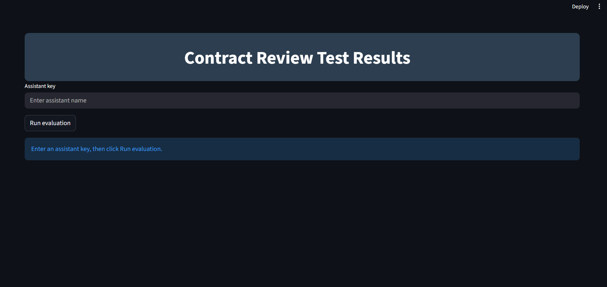
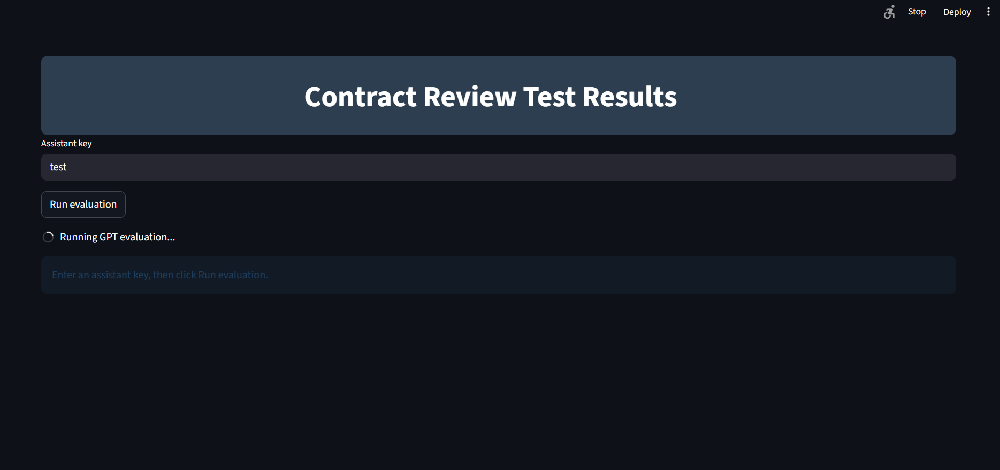
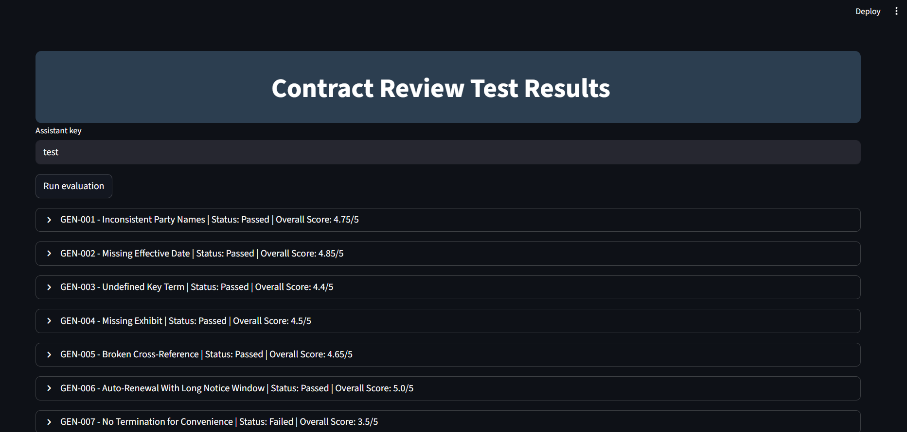
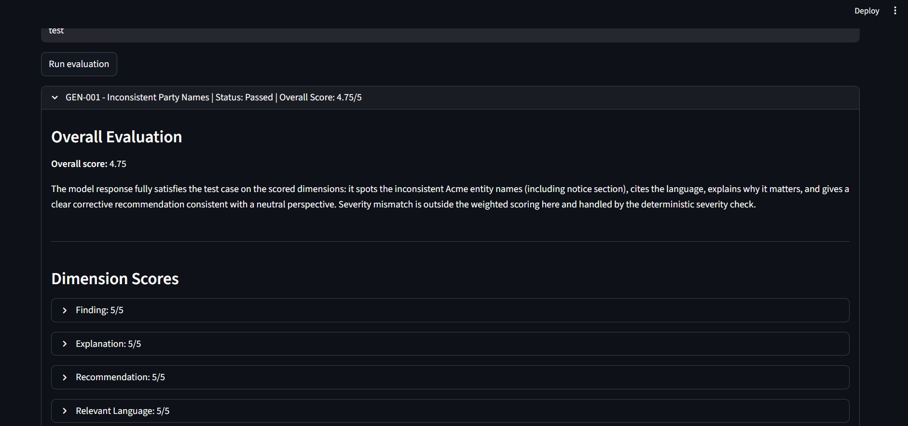
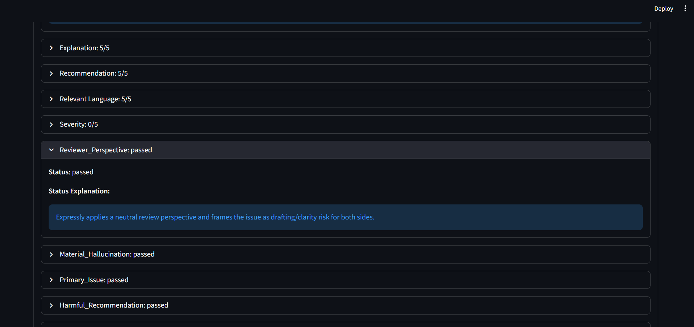
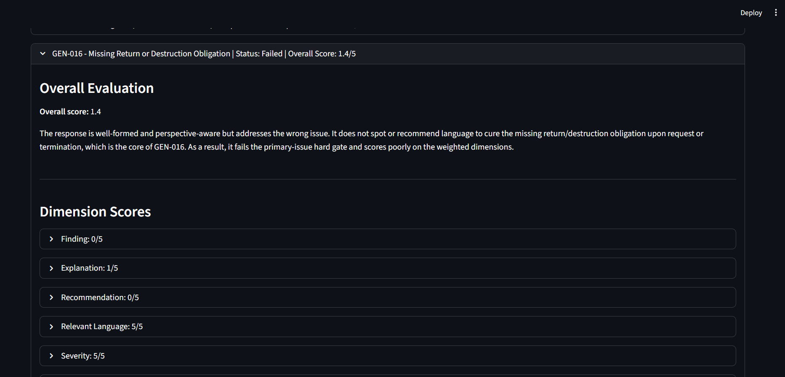
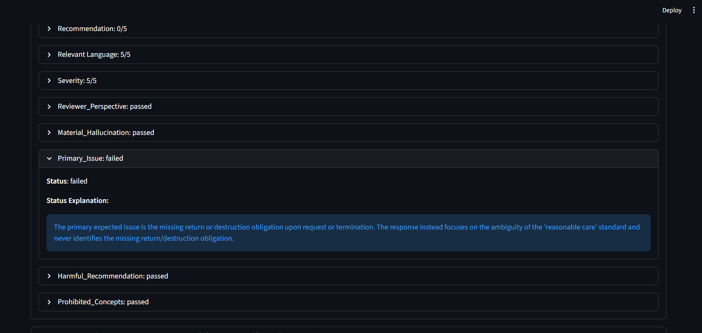

# Uplevel Evaluation System
The Uplevel Evaluation System is a workflow designed to test the capabilities of custom GPT assistants tuned to review legal contracts and output reliable and interpretable metrics based on performance through interaction with an intuitive interface. The name of the project is quite general since future goals involve expanding this into a more general evaluation system with support for many different types of custom GPT assistants.  

## The Responses API
In its current state, this evaluation system is designed specifically for custom GPT assistants designed to review contracts. The OpenAI Assistants API allows for interaction with assistants created through the OpenAI interface programmatically. Thus, anyone with a little knowledge of OpenAI's platform could create a custom GPT and it could be tested with a system like this one. That was the motivation to create this system. Unfortunately, as of 5/24/2026, the Assistants API is set to be deprecated on 8/26/2026. Therefore, we must employ the Responses API. This API does not allow for programmatic interaction with assistants, but we can re-construct the assistant inline with a few pieces of information. Because of this, setting up this code for use can be a little tedious. 

## Setting up an Assistant for Testing
Here is the project file structure for reference:

```text
Uplevel_Eval_System/
|-- assistants/
|-- eval_system/
|   |-- dashboard.py
|   |-- main.py
|   |-- openai_client.py
|   |-- prompts.py
|   |-- scoring_weights.py
|   |-- scoring.py
|   |-- test_case.py
|   |-- vector_store.py
|   |-- workflow.py
|-- knowledge_base_files/
|-- system_prompts/
|-- test_cases/
|-- vector_store_cache.yaml
```

There is already a test assistant set up if you just want to observe how the system works before setting up testing for your own assistant. Just enter test into the assistant key section on the dashboard to run the system with it.

The first step in setting up an assistant is to manually create a .yaml file detailing the assistant information. The assistant_template.yaml file gives the exact structure the file should follow. It's important that in the yaml file, the name field is identical to the file name minus the .yaml file extension. Finally, make sure this file is located in the assistants folder.

Next, we define the system prompt. These are the instructions for how the GPT should behave; through the OpenAI platform, this would go under the instructions section. To set up the system prompt, create a text file and make sure the file name without the .txt file extension is IDENTICAL to the assistant file name without the .yaml extension and the name field within the assistant file. Next, describe how you want the GPT to behave in the text file. If you wish to test an already existing assistant built on the OpenAI platform, copy exactly what you have under the instructions section and paste it into the text file. Finally, ensure this text file lives in the system prompts folder.

Next, the knowledge base needs to be defined. The knowledge base consists of files that the assistant GPT can search for relevant information during a conversation rather than relying solely on its training. First, create a folder in the knowledge_base_files folder with an IDENTICAL name to the assistant's file name without the .yaml extension, the name field in the assistant file, and the system_prompt text file minus the .txt extension for this assistant. Then, put all the files you want the assistant to be able to reference into the folder. Through the OpenAI interface, the number of files is limited to 10; however, through the Responses API, you can upload up to 10000 files, so keep that in mind if you define an assistant first with the Responses API and then want to later build it in the OpenAI interface. 

In order to create a knowledge base through the Responses API, you must create a vector store to which you upload files using a unique ID corresponding with that vector store. Vector stores are handled dynamically within the system. If a vector store doesn't exist for an assistant or one exists and it's expired, a new vector store is created. If a vector store already exists for an assistant and hasn't yet expired, the vector store is reused. To keep track of these vector stores and their ids, a file called vector_store_cache.yaml is created locally within the project.

Now you are ready to test your assistant! Note that running the entire testing system with all 30 standard test cases can take up to 15 minutes.

## How Does Testing Work?
The contract_review_general_case_template.yaml file details how a test case is structured, but here is an overview of the more important fields.

When an assistant is tested, it's run through a series of test cases, each designed to test a particular skill. Below is the skill list:

  - Issue spotting
  
  - Risk assessment

  - Clause extraction

  - Clause interaction

  - Redline suggestion

  - Drafting consistency

In addition to a skill, each test contains a legal category, contract type, reviewer perspective, input type (Short excerpt / Full clause / Multi-clause excerpt / Full agreement), and input text (the excerpt / clause / full agreement).

Currently, the project contains 30 contract review test cases. If you want to create your own, make sure to follow the template exactly, follow the naming convention, and put the test case in test_cases/contract_review/. 

For each test case, the assistant being tested gets the test name, reviewer perspective, contract type, input type, and the input. Then, it is asked to observe the input and give this structured output:

```json
{
    "issue_title": "",
    "finding": "",
    "relevant_language": [],
    "explanation": "",
    "severity": "Low",
    "recommendation": "",
    "reviewer_perspective_applied": ""
}
```
Here is an explanation of each field:

  - The finding field is the issue the assistant identified in the input text.

  - The relevant language field should be filled with language essential to explaining the issue. Examples are entity names, particular legal issues, or clauses. Basically, the language in the field is supposed to be so integral to the explanation that not including it in an explanation of the issue would make the explanation wrong. It is a quick way to check if the assistant completely missed the mark.

  - The explanation field is an explanation of why the finding is a contract / legal issue.

  - The severity field contains the severity of the finding.

  - The recommendation field contains the assistant's recommendation on how to resolve the issue it identified.

  - The reviewer_perspective_applied field contains the party position the assistant reviewed the input text with.

## Scoring 
For each test case, the assistant is given a score out of 5 where 4 is considered a pass. This score is a weighted average of scores given to the following assistant response fields:

  - finding: Scored on a scale of 0-5 by an LLM judge.

  - relevant language: Given a score of 5 if fuzzy matching scores high enough. Otherwise, an LLM judge fallback is used to check if the assistant's relevant language matches in meaning to the expected relevant language. If it doesn't, it is given a score of 0.

  - explanation: Scored on a scale of 0-5 by an LLM judge.

  - severity: Severity levels are low | medium | high | critical. If the right severity level is given, a score of 5 is given; otherwise, a 0 is given.

  - recommendation: Scored on a scale of 0-5 by an LLM judge.

Each score is weighted according to a weight profile, which is chosen based on the primary skill being tested. Each skill has a different weight profile.

## Hard Gates
An assistant can score well and still fail a test. There are hard gates in place to catch critical errors. An LLM judge determines if the model response has breached any of these hard gates, and if it has, the test case is failed regardless of score.

The hard gates are:

  - Reviewer perspective: If the assistant reviewed the input from the wrong perspective it fails. Additionally, if the finding, explanation, and recommendation don't support the reviewer perspective the assistant claimed to apply, it fails.

  - Material hallucination: If the assistant hallucinates any information that was not provided through the test case it automatically fails.

  - Primary issue: If the assistant identifies an issue but fails to identify the main issue in the input text it automatically fails.

  - Harmful recommendation: If the assistant's recommendation is potentially harmful to the party position it reviewed from, it automatically fails.

  - Prohibited concepts: Each test case has a prohibited concepts field, which are concepts that, if brought up, mean the assistant completely missed the mark. If any of these are brought up, the assistant automatically fails.


## Set Up

### Prerequisites

Before getting started, make sure you have access to:

  - Python 3.10+    
  - An OpenAI API key

### Installation

Clone the repository:

```bash
git clone https://github.com/noahdpack/gpt_evaluation_system.git
cd gpt_evaluation_system
```

Create and activate a virtual environment:

```bash
python -m venv venv
source venv/bin/activate
```

Or on Windows activate with:

```bash
.\venv\Scripts\activate
```

Install dependencies:

```bash
pip install -r requirements.txt
```

Create a .env file in the project root:

```bash
touch .env
```

Add your OpenAI key to the .env file:

```text
OPENAI_API_KEY = your_api_key_here
```

To run the project locally, make sure you are in gpt_evaluation_system/eval_system/ and use:

```bash
streamlit run main.py
```

After running the code, type test to run the pre-made assistant through the evaluation system or type the name of any assistant you have defined. Make sure the name matches the assistant yaml file exactly.

## Screenshots
The following are screenshots displaying the dashbaord and its features.

### Dashboard Initial Launch
This is what the dashboard looks like right after running main:



### Enter Assistant Name
First enter the name of the assistant you want to test. Use test to run the pre-made assistant:


### Start the Tests
To start the tests click the Run evaluation button. The dashboard should look like this after the button was clicked:



### Finished Evaluation
The entire evaluation with the standard assistant and test cases can take up to 15 minutes. This is what the dashboard should look like after a successful evaluation:



### Scoring Info
You can click on each test case to get a dropdown with information on how the assistant performed on each scoring dimension and hard gate:





### Failed Testcase
Here is what a failed test case looks like based on scoring and then on a hard gate:




